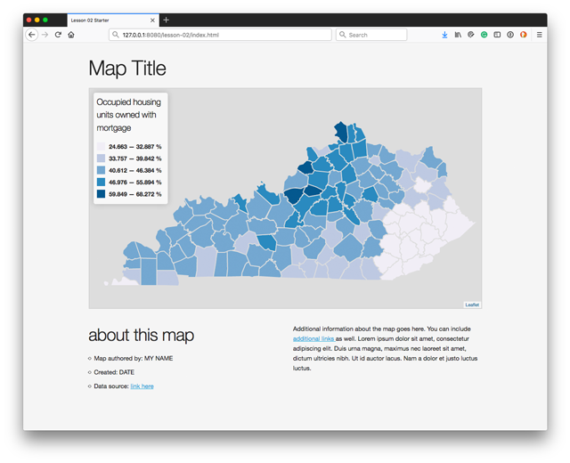
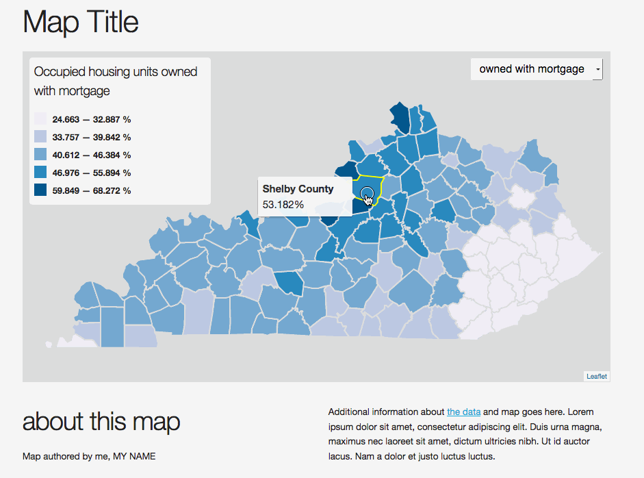
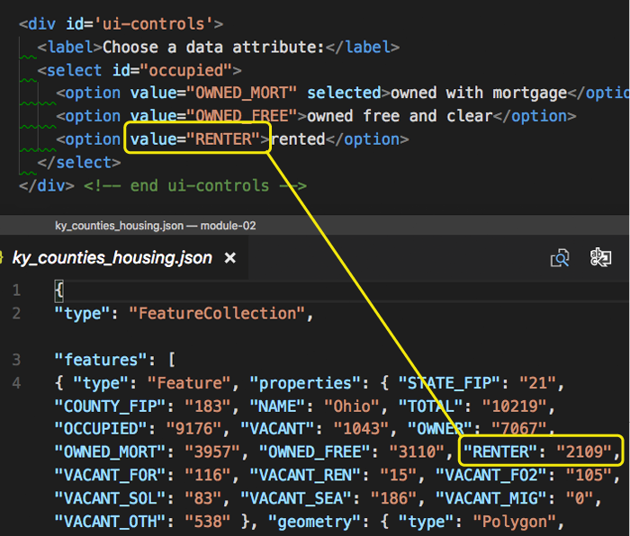
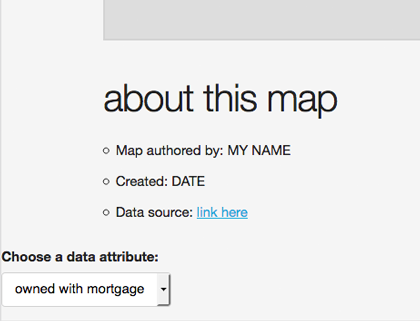
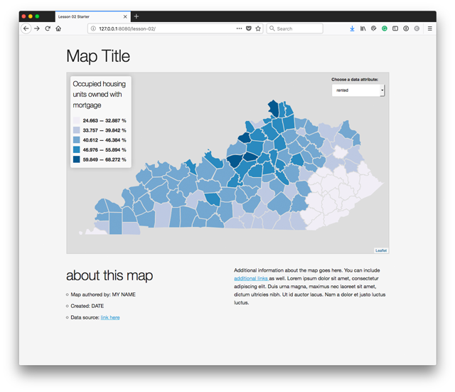
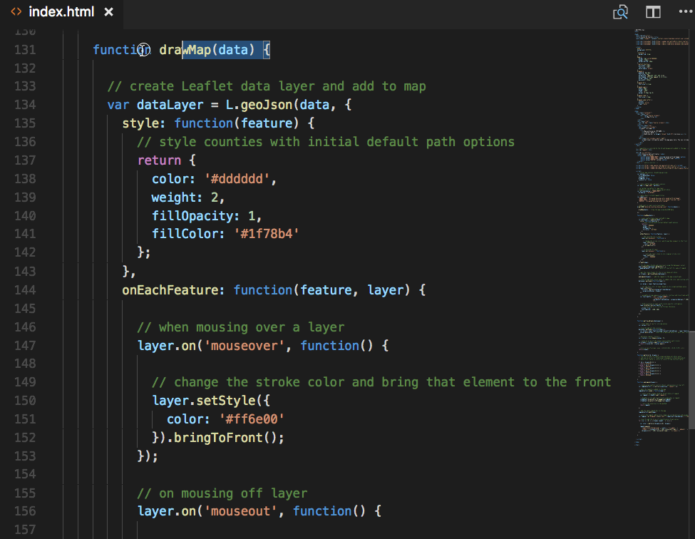
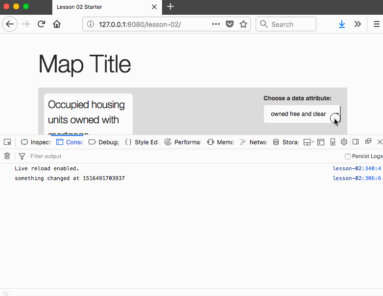
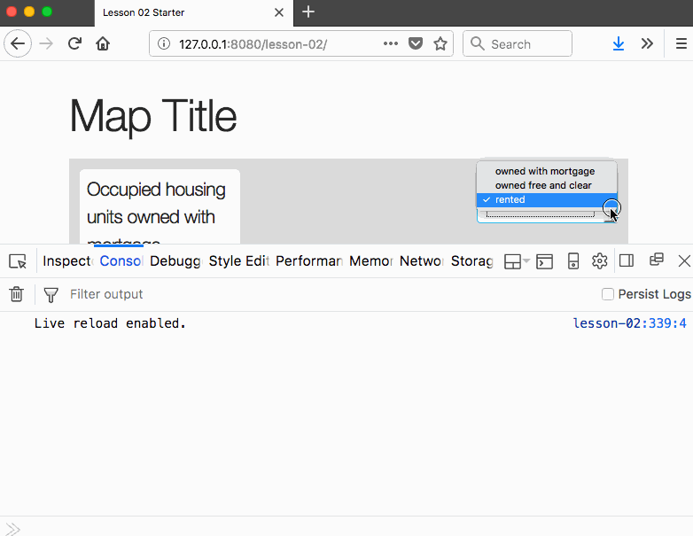
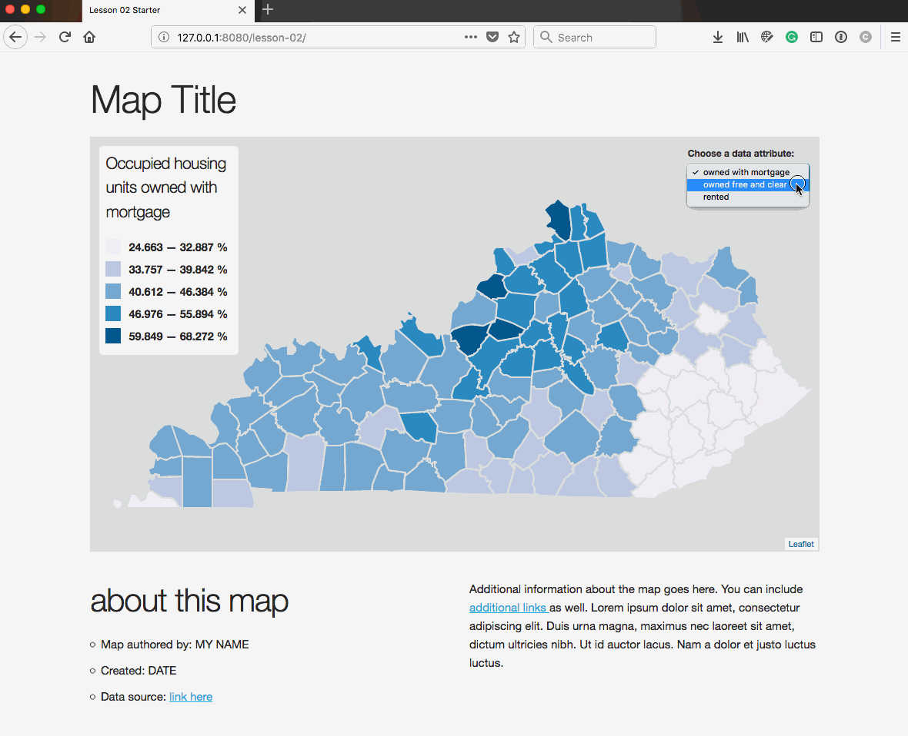

# Lesson 02: Toward Advanced User Interaction In Web Maps

In Module 10 of MAP672, we used an AJAX request to dynamically request a GeoJSON data file and load it into the script after the DOM had loaded. We then wrote functions to normalize and classify the data on the fly, appropriately color a choropleth map, and dynamically create a legend depicting the class ranges. Within this lesson, we extend this code to build a **user interface (UI)** element allowing the user to choose a new data attribute to dynamically update the map and legend.

> My work was flat, because it was missing the spark that comes from creating something you believe in for someone you care about. <span style="float:right">&ndash; Frank Chimero, _The Shape of Design_<span>

## TOC

<!-- TOC -->

- [Lesson 02: Toward Advanced User Interaction In Web Maps](#lesson-02-toward-advanced-user-interaction-in-web-maps)
  - [TOC](#toc)
  - [Toward User Interaction](#toward-user-interaction)
  - [Structuring functions within JavaScript](#structuring-functions-within-javascript)
  - [Building a user interface for updating the map](#building-a-user-interface-for-updating-the-map)
    - [Adding and positioning the dropdown menu to the map](#adding-and-positioning-the-dropdown-menu-to-the-map)
      - [Structuring a UI form element in HTML](#structuring-a-ui-form-element-in-html)
      - [Using the Leaflet L.Control class to add UI elements to the map](#using-the-leaflet-lcontrol-class-to-add-ui-elements-to-the-map)
  - [Refactoring a function for dynamic updating](#refactoring-a-function-for-dynamic-updating)
    - [Adding the functional interaction to the interface](#adding-the-functional-interaction-to-the-interface)
    - [Applying the user selected value to the map](#applying-the-user-selected-value-to-the-map)
  - [Lesson Task](#lesson-task)
  - [Deliverable](#deliverable)
  - [Resources](#resources)

<!-- /TOC -->

## Toward User Interaction

Begin this lesson by reading and reflecting upon Frank Chimero's [Chapter Two: Craft and Beauty](http://shapeofdesignbook.com/chapters/02-craft-and-beauty/) (~6 pages).

Open the *index.html* file found in the *lesson-02/* directory in both your code editor and the browser. Edit this file as you progress through the lesson. Save your work and commit to your Git repository as you work.

  
**Figure 01.** Starter page for Lesson 02.

Take some time to read through the starter file's HTML/CSS/JS and comments to more fully understand the program, before beginning. 

Note that the layout uses the [CSS boilerplate Skeleton](http://getskeleton.com/). Skeleton's *skeleton.css* file is very small and offers styling for many HTML elements, though is not as robust as Bootstrap and uses no JavaScript. It does, however, recommend using [normalize.css](https://necolas.github.io/normalize.css/), which should be loaded into the page before Skeleton's:

```html
<link rel="stylesheet" href="https://cdnjs.cloudflare.com/ajax/libs/normalize/7.0.0/normalize.min.css" />
<link rel="stylesheet" href="https://cdnjs.cloudflare.com/ajax/libs/skeleton/2.0.4/skeleton.min.css" />

<style>
  /* custom styles here */
```

It is important to recognize that we've written this script in a flexible manner. We only need to change the value of our two global data attributes, `attributeValue` and `normValue`, to generate an entirely different map! For example, to see the percent of total housing units that are vacant, modify the values of these variables and reload the script in the browser:

```javascript
var attributeValue = "VACANT",
  normValue = "TOTAL";
```

Changing these values from "OWNED\_MORT" "OCCUPIED" to "VACANT" AND "TOTAL" gives us an entirely new map! Think how much easier that was than if we had hard-coded the values of "OWNED_MORT" and "OCCUPIED" throughout the script. We would need to look through all the code and change those values manually (or a quicker find and replace, but you get the point). This flexibility provides for what you should be anticipating is our next step: to give the user the ability to select various data attributes and update the map dynamically. 

User interaction is one of the most important differences between traditional static maps and maps we now make for and use on the web. The ability to change the map not only offers new possibilities for understanding the information. It also empowers the users and makes engaging with the map more fun and interesting.

In this lesson, we continue the design and the development of the starter template to give the user the ability to switch between various data attributes within the  *kentucky_counties_housing.json* data file using a dropdown UI element. The map will dynamically update to reflect these changes by updating the values of the  `attributeValue` and `normValue` variables within the script.

The result will look something like this:

  
**Figure 02.** The final map of the lesson.

Notice that not only does map update, the legend too displays the updated legend title and the re-calculated classification breaks for the data distribution.

Before we get to adding interaction to this map, let's take some time to better understand how the script is structured and runs using the various functions. This is a challenging aspect for previous New Maps Plus students at this juncture, so read carefully and contact your instructor for further clarification if the flow of the programs execute is still puzzling.

## Structuring functions within JavaScript

We'll be declaring and defining more functions within this module. Often, we're confused where we should write these functions. The answer isn't straightforward, but as far as the computer is concerned, it doesn't really matter. Because of function hoisting, they are ready and waiting to be called where ever we write them.

It's common to write them vertically (down) through the coded script in the order in which they are called. So far, within the  script for this module, we see the functions follow this order as you read down through the code:

```javascript
// loads the data and draws the initial map
$.getJSON( { ... });
// updates the map with colors and adds the tooltip
function drawMap() { ... }

// derives a range of data values and computes a class range from these
function getClassBreaks() { ... }

// determines a particular color given a value and class ranges
function getColor(d, breaks) { ... }

// draws a legend using the class ranges
function drawLegend(breaks) { ... }
```

Though we can declare these functions in any order within the script, it's often best in these simpler applications to write the functions within the script from top to bottom as to follow the flow of the execution of the program.

Within this module **we will not be declaring functions within other functions**. However, we will be calling our functions, as well as Leaflet and JQuery methods, from within the function bodies.

As always, keep your indentations clean within your script and be consistent (4 spaces, 1 2-space tab, 1 4-space tab, etc)!

**What does matter, tremendously, is the order in which the functions are invoked or called when the script runs.** This is something you need to think carefully about as you code, especially as you refactor code to extend functionality. 

It's helpful to think through the flow of the program's execution. Begin when the page loads. What is the first line of JavaScript to execute? when a statement calls a function, jump down to that function in your mind and run through the code within the function body. Does it return a value? Follow the flow of execution back to where the function was called. If the function calls another function, jump to that one and continue to follow the execution of JS statements.

It's important to cultivate the ability to follow the execution of the code in your mind, rather than simply scanning statements and functions for syntax errors. Applying `console.log()` statements is also useful for determining the order in which certain statements in your script are executed.

Re-consider the existing functions in our starter template and which functions they're responsible for calling (as well as how many times):

```javascript
// calls the drawMap() function once
$.getJSON( { ... });  

// calls the getClassBreaks() function once, the getColor() function 120 times, and the drawLegend() function once
function drawMap(data) { ... } 

// doesn't call any functions, but returns the class break ranges
function getClassBreaks(dataLayer) { ... }  

// doesn't call any functions, but returns a specific color value
function getColor(d, breaks) { ... }  

// draws a legend using the class ranges; doesn't call any functions
function drawLegend(breaks) { ... } 
```

As we can see, the `drawMap()` function is where most of the function calls originate. And the order in which they are called within this function body matters. The `getClassBreaks()` function must be called before the `getColor()` function does. Why? Because the `getColor()` function needs the return values (the class break ranges) from the  `getClassBreaks()` function. This information must be passed as an argument:  `getColor(value, breaks)`. What about the call for the `drawLegend()` function? This too needs to follow the call to the `getClassBreaks()` function as it needs to pass the class break ranges as an argument, because the `drawLegend()` function needs those class breaks within its function body.

## Building a user interface for updating the map

At the end of the day, we want to host this map on a web server and share it with the world. Obviously, the user will be unable to edit the code directly to update the mapped data attributes. Rather, we want to provide a **user interface** for interacting with the code, which in turn will update the map. How do we go about building such an interface?

One solution would be to draw several Leaflet GeoJSON layers using different data attributes and use the [Leaflet Layer Control](http://leafletjs.com/examples/layers-control/) (introduced in MAP672) to toggle the visibility of these layers on and off. This solution is okay, but we want to push ourselves to explore more flexible solutions for interface design.

Rather than use Leaflet's layer control, we're going to make use of HTML forms to enhance the user's interaction with our map. HTML forms are web standards, natively supported in modern browsers (i.e., not requiring additional JavaScript libraries) and used for user interaction. Read more about  [HTML forms](https://developer.mozilla.org/en-US/docs/Web/Guide/HTML/Forms) and  [HTML form elements](http://www.w3schools.com/html/html_form_elements.asp).

Within this lesson, we'll also be using more of JQuery's functionality to select HTML elements and "listen" for user interaction upon them (i.e., "did the user select an option in this dropdown?"). 

### Adding and positioning the dropdown menu to the map

We'll begin by first modifying our document to include a form element to our HTML. While either radio buttons or a dropdown list is suitable for this task, we'll go with the dropdown. To do this, we'll use the [`<select>` form element](https://developer.mozilla.org/en-US/docs/Web/HTML/Element/select).

#### Structuring a UI form element in HTML

Let's begin by creating a generic `<div>` wrapper for our user interface controls and give it with an `id` attribute value of `ui-controls`. While optional, this `<div>` tag with an id attribute is handy because they can be used to apply CSS style rules specifically the UI elements (i.e., their appearance or placement), as well as to use JavaScript to select the entire set of controls to place it on our Leaflet map or somewhere on the page.

Since we can dynamically place this element on or around our map, it doesn't matter so much where we write it within the HTML. To keep the structure of our HTML clean and readable, place it directly below the already-existing legend (but above the `<script>` tags that load the JS files):

```html
<!-- legend div is selected by the JS and dynamically added to the map -->
<div id="legend"></div>

<!-- ui-controls div is selected by the JS and dynamically added to the map -->
<div id='ui-controls'>
  <!-- write form element in here -->
</div> <!-- end ui-controls -->
```

Within this `<div id='ui-controls'></div>` division element, add a `<select>` form element with a few `<option>` elements within it. For this lesson example, let's say we're still offering the user a map showing the percentages of housing units that are occupied. Rather than just showing those units owned with a mortgage, we want to additionally allow the user to select the data attribute of those owned "free and clear" and those occupied by a renter (again, reference the [ky_counties_housing.txt file](data/ky_counties_housing.txt) for the meanings of the data attributes as they're encoded within the GeoJSON file.

Within the `<select>` tags, write three `<options>` HTML elements, one for each of the data attributes we wish to allow the user to map. Within the `<option>` tags, we've also provided a meaningful title (i.e., "owned with a mortgage"). Obviously, this title can be changed as we see fit based on what we think would be most useful to the user. Here's how we build that form element with HTML:

```html
<div id='ui-controls'>
  <label>Choose a data attribute:</label>
  <select id="occupied">
    <option value="OWNED_MORT" selected>owned with mortgage</option>
    <option value="OWNED_FREE">owned free and clear</option>
    <option value="RENTER">rented</option>
  </select>
</div> <!-- end ui-controls -->
```

Note that we've provided the form elements with a couple attributes:

* We've given the `<select>` element an `id` value of `occupied`. We'll be using this later to allow JQuery to target this specific `<select>` element and listen for user-driven changes.
* We've also given each of the `<option>` elements a `value` attribute. These values correspond to the properties encoded within our GeoJSON data file:

  
**Figure 03.** Visually connecting the values of the select options to property values in the GeoJSON data file.

When the user selects the option called "rented", our JavaScript code can get the value of `RENTER` from the option's `value` attribute and use it to udpate the map.

You'll also notice that we've included the `selected` property on the first option in the HTML, which is a Boolean value indicating that this option is initially selected. This is the text that the user will see in the dropdown menu when the page loads.

We've also added an additional HTML element to our user interface controls at this point: a `<label>` element, which will help the guide the user's actions.

If we save our file now we can see the form element added to the document but positioned outside of the grid system in the lower left corner of the page:

  
**Figure 04.** An unstyled form element added to the HTML document.

The form dropdown functionality currently works in terms of being able to change the selection within the dropdown, but obviously changing the selection doesn't do anything yet. We need to write code to listen for that change and execute further statements.

Let's now select the UI controls for our dropdown and remove it from the normal display order within the DOM, dynamically placing it within a Leaflet-generated div element on the map itself.

#### Using the Leaflet L.Control class to add UI elements to the map

Leaflet.js provides a method for selecting existing DOM elements, such the div element we just created and gave an `id` attribute of `ui-controls`:

```javascript
L.DomUtil.get("ui-controls");
```

Leaflet also provides methods for creating a new  and adding it to the map, rendered within the DOM above the map and the other [map panes using a higher z-index](http://leafletjs.com/reference-1.3.0.html#map-mappane) stacking order. The starter template for this lesson uses the same technique to add the legend to the map. See [L.Control](http://leafletjs.com/reference-1.3.0.html#control).

Toward the bottom of the script, after the `drawLegend()` function (and **outside of another function's body curly braces, e.g., `{ ... }`)**, write a new function named `addUi()`.

```javascript
function addUi() {
  // create the slider control
  var selectControl = L.control({ position: 'topright'} );

  // when control is added
  selectControl.onAdd = function(map) {
    // get the element with id attribute of ui-controls
    return L.DomUtil.get("ui-controls");
  }
  // add the control to the map
  selectControl.addTo(map);
}
```

Now add the `addUi()` function call to the script, writing this at the bottom of the `drawMap()` function (but within that function's body):

```javascript
addUi(); // add the UI controls
```

We should now see our dropdown HTML element added to the top right corner of the Leaflet map.

  
**Figure 05**. The dropdown UI element added to the Leaflet map.

Of course, changing the dropdown select option doesn't do anything yet. Let's now move on to get our UI functionality working within the JavaScript and dynamically add it to our map. To do so, we first need to write a new function and refactor the code a bit.

## Refactoring a function for dynamic updating

This section covers a very important concept in programming: understanding what blocks of code we only want to execute once and those we want to execute repeatedly. In this case, we know we only want to draw our Leaflet map once (i.e., `L.geoJson(data).addTo(map);`). After that happens, we want update the colors of the features more than once, but we don't need to keep creating the L.geoJson() layer and adding it to the map. Rather, we need another function to update the fill colors of the existing map. We do this by separating these respective blocks of code into separate functions.

Currently, our `drawMap()` function takes the GeoJSON data, draws it to the map, classifies the data (using another function), and applies a color to each of the features based on the value of `attributeValue` (returned from the `getColor()` function). We want to now update our script so that the `drawMap()` function draws the features and a new function named `updateMap()` classifies the data based on the current attribute and updates the maps features with new fill colors.

Write a new function named `updateMap()` (below the `drawMap()` function). We'll need to move some of the code from the `drawMap()` function into this one. Cut and paste the code from the `drawMap()` function into the `updateMap()` function that .

```javascript
// get the class breaks for the current data attribute
var breaks = getClassBreaks(dataLayer);

// add the legend to the map using breaks
addLegend(breaks);

// loop through each county layer to update the color and tooltip info
dataLayer.eachLayer(function(layer) {

  var props = layer.feature.properties;

  // set the fill color of layer based on its normalized data value
  layer.setStyle({
    fillColor: getColor(props[attributeValue] /
      props[normValue], breaks)
  });

  // assemble string sequence of info for tooltip (end line break with + operator)
  var tooltipInfo = "<b>" + props["NAME"] + 
            " County</b></br>" +
            ((props[attributeValue] / props[normValue]) * 100).toLocaleString() + "%";

  // bind a tooltip to layer with county-specific information
  layer.bindTooltip(tooltipInfo, {
    // sticky property so tooltip follows the mouse
    sticky: true,
    tooltipAnchor: [200, 200]
  });

});
```

The following GIF animation demonstrates that step:

  
**Figure 06.** Separating code from within one function into a new function for dynamic updating.

Saving and refreshing your browser should show our Kentucky counties again, colored blue. Why isn't the map being colored as a choropleth? 

We've written a function, but we haven't called it. Include the necessary code in your `drawMap()` function to call the `updateMap()` function (passing `dataLayer` as the argument). You can place this directly after the function call to add the UI to the map:

```javascript
addUi(dataLayer); // add the UI controls
updateMap(dataLayer) // update the map with the current data attribute
```

Once you've done that, you should see a similar map as before. We've simply separated the functionality into two separate functions.

  
**Figure 07.** Map displayed as before, with `drawMap()` and `updateMap()` functions.

The conceptual takeaway from this process in terms of coding is that the function that draws the features to the Leaflet map (`drawMap()`) fires only once, but the function that reclassifies the data and updates the map fires repeatedly (`updateMap()`).

Now that we've separated the code into two functions, we can continue to build the script so that it calls the updateMap() function each time the user selects a new attribute form the dropdown menu.

### Adding the functional interaction to the interface

Above we wrote a UI element in the HTML. Now we need to connect changes in that dropdown selection to the JavaScript itself.

Update the code within the `addUI()` function to:

1. select our `#ui-controls` div
2. add an event listener for when the user changes the selection, and
3. call the `updateMap()` function to redraw the map

The first step is to determine which option the user has selected when the dropdown is changed. Above, we briefly introduced JQuery's powerful capabilities to select DOM elements. Here again, we'll begin by selecting the form element itself. We can do this easily with the code `$('select')`.

However, what if we had multiple select forms in the DOM? We can be more specific in our selection by utilizing the name attribute of our select form, `$('select[id="occupied"]')`. Remember we gave this select form a `id` attribute of `occupied`  when we defined our dropdown form using HTML.

Once we have the form selected, we can then use the JQuery method `change()`, which in technical terms binds an "event handler" to a JavaScript change event. This method then "listens" for when the user changes this select form (the "event"). Read the docs for JQuery's change method here: [http://api.jquery.com/change/](http://api.jquery.com/change/).

First write the code for selecting the element and implementing the JQuery `change()` method. Also, issue a `console.log()` message to test and verify that it's, in fact, selecting our form element and detecting the user interaction.

```javascript
$('select[id="occupied"]').change(function() {

  // code executed here when change event occurs
  console.log('something changed at ' + Date.now());

});
```

Within the log statement we can include the time of the event, expressed in the number of milliseconds elapsed since January 1, 1970 00:00:00 UTC using JavaScript's [Date prototype](https://developer.mozilla.org/en-US/docs/Web/JavaScript/Reference/Global_Objects/Date).

  
**Figure 08.** The select form text message logged to the Console

The code within the callback function is executed every time a change occurs on the select form. Our next objective is to determine which of the options the user has selected. Notice that if we `console.log(this)` the mystifying word `this`, it refers to the "context" of the event, i.e., the select form element itself:

```javascript
$('select[id="occupied"]').change(function() {

    console.log(this);

});
```

The following GIF animation shows the entire select element being logged to console each time it is changed and we log `this` to Console. Within the output, we also see we have access to the options within the select element.

  
**Figure 09.** The select form ('this') logged to the Console.

That's neat, but not immediately useful. We need to know which option has been selected by the user. The browser, by default, will change the selected attribute to true for an option that has been selected within the select form, and to false for a previously selected option. So how then can we determine which is selected?

To do this, we can access the `value` property from `this`, and will test with a `console.log()` statement to verify:


```javascript
$('select[id="occupied"]').change(function() {

  console.log(this.value);

});
```

Changing the form selection multiple times verifies that we're able to access the attributes values of our selected options:

  
**Figure 10.** The select option value logged to the Console.

Great! What do we now do with this information? Recall how at the beginning of our script we declared a global variable named `attributeValue` and first hard coded a value of `OWNED_MORT` to it? Because this variable is global, we can now simply reassign it the value the user has selected! So:

```javascript
$('select[id="occupied"]').change(function() {

  attributeValue = this.value;

});
```

Within our script we now have access to which option the user has selected, which we've written to match the data attribute names within the GeoJSON data file. Now let's update that map!

### Applying the user selected value to the map

Now that we've reassigned the value of our global variable `attribute` to the currently selected option, we want to redraw the map using this attribute. Thankfully, we wrote our initial code to draw the map in a very flexible manner, so this won't be very difficult at all!

Recall how in the callback function of our `drawMap()` method, we first drew our Kentucky county geometries, and then we called another function, `updateMap()` which first calculated the classification break ranges, looped through all the layers (a.k.a. counties), and assigned them a color value based upon the global variable `attributeValue`? What happens now, once we've reassigned the value of `attributeValue` to a new value, if we again call that `updateMap()` function?

```javascript
$('select[id="occupied"]').change(function() {
    // store reference to currently selected value
    attributeValue = $(this).val();

    // call updateMap function
    updateMap();

});
```

Writing and saving this code, however, doesn't update the map as expected. Why not? Because when we modify our functions and write new ones, we need to revisit where they are called and what arguments are being passed to them.

Remember that the `updateMap()` function definition requires one parameter. We created the `dataLayer` variable within the `drawMap()` function and scoped it to that function, passing it as an argument when we first called `updateMap()` (e.g., `updateMap(dataLayer)`). We'll want access to `dataLayer` within the `addUI()` function as well. So we need to update the function call from `addUI()` and the `addUI()`function definition to reflect this:

  
**Figure 12.** The variable `dataLayer` being passed as an arguments among functions.

The result is successful user interaction! We've connected the user interface to our code. Changing the selection multiple times now loops through our `dataLayer` layers and reassigns a color based upon the user selected data attribute value.

  
**Figure 09.** Redrawing the map based upon user input.

Congratulations! You've just built a sophisticated, custom UI element allowing the user to reexpress that mapped features with a difference dataset.

## Lesson Task

Currently, the legend is also created anew with each selection change:

1. selected and added to the map using Leaflet's `L.DomUtil()` and `L.Control()` classes, and
1. updated with a new legend title and classification ranges using the updated `breaks` values

While this solution works well on the user end with no noticeable performance hits, there is some redundancy in the code. We're effectively selecting the legend with each dropdown selection and re-adding it to the map before updating the legend title and class range values.

We can update the code responsible for 1.) adding the legend and 2.) updating the legend in a similar way as we are currently 1.) adding the geometries to the map and 2.) updating the fill colors of the features using a separate function.

**Task:** Rewrite the legend code so that the `addLegend()` function only adds the HTML legend to the map and a new function named `updateLegend()` updates the title and class range values when the user selects a new data attribute (**2/4 points for the assignment**).

## Deliverable

Commit all changes to the completed map from the lesson (_lesson-02/index.html_) and push up to the repository when submitting Assignment #2.

Don't worry about updating the content of the webpage (i.e., title, about, etc) or changing the visual design of the lesson map (save this for the [lab assignment](lab-02/)). Be sure that your code is well-structured with proper indentions and is well commented.

## Resources

* [Leaflet Layer Control](http://leafletjs.com/examples/layers-control/)
* [HTML forms](https://developer.mozilla.org/en-US/docs/Web/Guide/HTML/Forms) and  [HTML form elements](http://www.w3schools.com/html/html_form_elements.asp)
* [HTML select element](https://developer.mozilla.org/en-US/docs/Web/HTML/Element/select)
* [Leaflet's map panes' z-indexes](http://leafletjs.com/reference-1.3.0.html#map-mappane) 
* [L.Control](http://leafletjs.com/reference-1.3.0.html#control)
* [JQuery's change method](http://api.jquery.com/change/)
